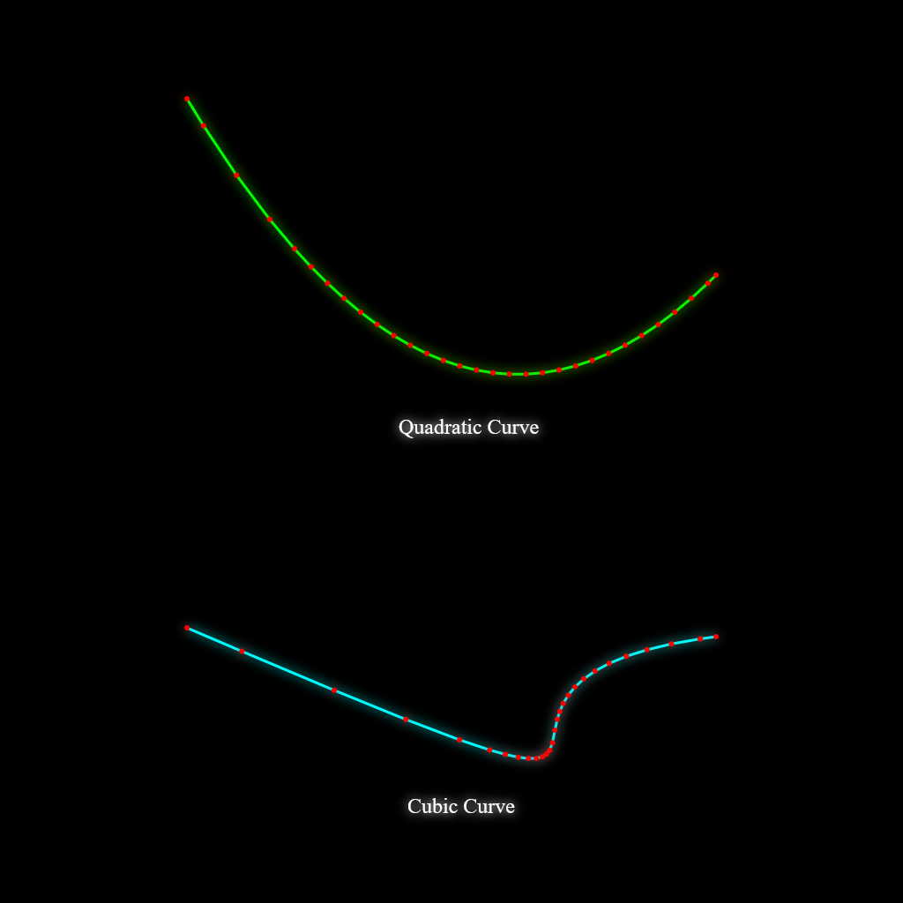
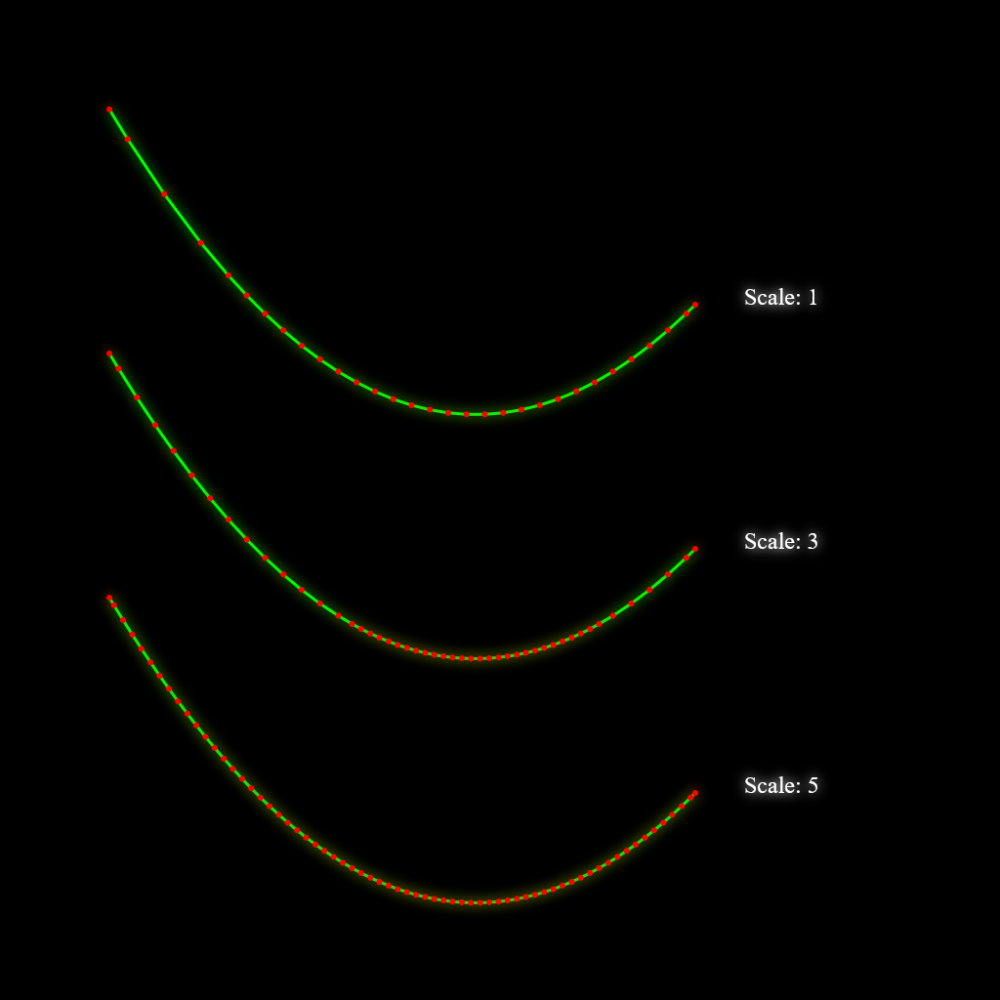

# adaptive-bezier-subdivider

Flattens a 2D bezier curve into a sequence of line segments adaptively, meaning it will use less points for the segments that are not curved very much and more points for the highly curved parts. It achivies this by recursively subdividing the curve until it is indistinguishable from a line segment.

It is a cleaned up version of [Matt DesLauries](https://github.com/mattdesl) port ([quadratic](https://github.com/mattdesl/adaptive-quadratic-curve), [cubic](https://github.com/mattdesl/adaptive-bezier-curve)) of **Anti-Grain-Geometry**'s bezier subdivision algorithm, it is updated to use the more modern class and module features of javascript. You can find the original algorithm and implementation [here](https://agg.sourceforge.net/antigrain.com/research/adaptive_bezier/).



## Installation

This library can be used on both **node** and **browser**.

For **browsers** just put the [index.js](./index.js) file in a suitable place then import it in your script normally:

```js
import { AdaptiveQuadraticBezierBuilder, AdaptiveCubicBezierBuilder } from "./path-to-index.js"
```

In node applications, install it via npm

```
npm install adaptive-bezier-subdivider
```

then import it normally:

```js
import { AdaptiveQuadraticBezierBuilder, AdaptiveCubicBezierBuilder } from "adaptive-bezier-subdivider"
```

## Example

The library contains two classes, one for dealing with quadratic bezier curves:

```js
import { AdaptiveQuadraticBezierBuilder as QBuilder } from "adaptive-bezier-subdivider";

const quadCurve = {
  P0: [-300, 0],  //curve start point
  P1: [0, 500],   //control point
  P2: [300, 200], //curve end point
};

const qb = new QBuilder();

//the method flatten returns a flat array of x and y coordinates
const quadPoints = qb.flatten(quadCurve.P0, quadCurve.P1, quadCurve.P2);

console.log(quadPoints);
//[x0, y0, x1, y1, ...]
```

You can also provide a **scale** argument to the **flatten** method, it will apply a finer subdivision interval so that the curve can be used in a scaled context without loosing detail for the cost of more processing time and storage:

```js
const quadPoints = qb.flatten(quadCurve.P0, quadCurve.P1, quadCurve.P2, 3);
```

Here is a comparison image when using a the scale factor:



You can also provide and array to the flatten method
and it will append the resultant points to that array

```js
//returns the same arr appended to its end the computed points
const quadPoints = qb.flatten(quadCurve.P0, quadCurve.P1, quadCurve.P2, 3, arr);
```

There is also another class for dealing with cubic curves and the API is basically the same as above:

```js
import { AdaptiveCubicBezierBuilder as CBuilder } from "adaptive-bezier-subdivider";

const cubicCurve = {
  P0: [-300, 0],   //curve start point
  P1: [400, 300],  //first control point
  P2: [-100, 60],  //second control point
  P3: [300, 10],   //curve end point
};

const cb = new CBuilder();

const cubicPoints = cb.flatten(
  cubicCurve.P0,
  cubicCurve.P1,
  cubicCurve.P2,
  cubicCurve.P3,
  3,  //scale
  arr //your array, if not provided will create and return a new one 
);

console.log(cubicPoints)
//[x0, y0, x1, y1, ...]
```

## Usage

All the class constructor parameters and method parameters
are annotated with **JSDoc**. you can find the usage there.

**Note**: the constrcutor and methods of these classes don't have input validation, you have to provide the correct parameters or only god knows what will happen *(probably will just throw an error)*.

## TODO

Add input validation